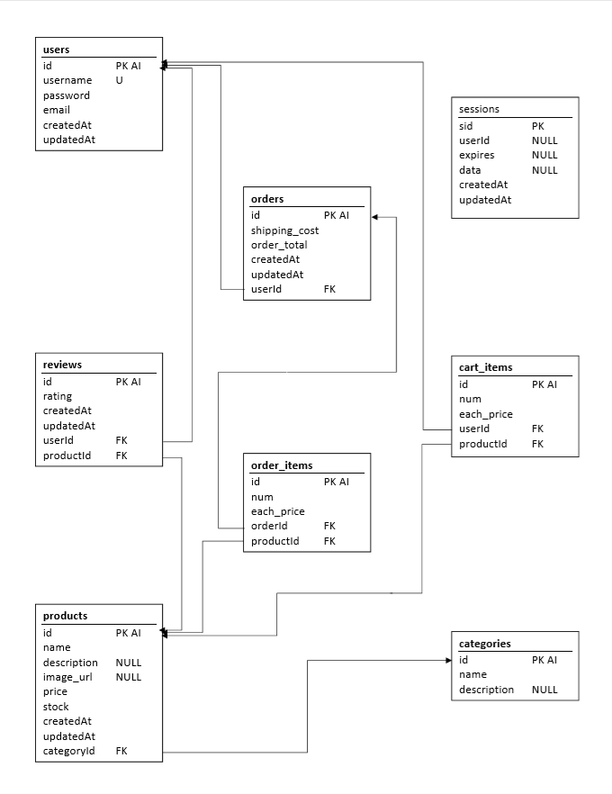

# eMarketplace

[](https://standardjs.com)

An online marketplace simulating a digital store inventory with a user account system that allows users to place an order for items/services and checkout.
This store allows a user to:

- Create an account
- Log in & Edit an account
- Add items to a cart
- Update and remove Items from the cart
- Submit an order.
- View placed order.
- View all orders placed from that account.

---

## Getting Started

To use this project, you'll need to do the following:

- Clone this repository onto your computer or upload it to heroku.

- If you're running it locally on your pc, also perform these steps:

  - run `npm i` from the terminal (this will install the npm modules: dotenv, bcrypt, connect-session-sequelize, express, express-handlebars, express-session, mysql2, passport, sequelize and validator)
  - create the mysql database using the `schema.sql` file
  - create a `.env` file with your MySQL Database password in the following format
    (this was included in the `.gitignore` file to prevent the password from being exposed on Github):

  ```env
  # Database Connection Url for connectioning to your local database. 
  DEV_DATABASE_URL='mysql://[db_username]:[db_password]@[db_host]/[db_name]'
  ```

This file will be imported by `config/config.json` while running on your computer locally because of the following changes to the `config/config.json` file.

```json
  {
    "development": {
      "use_env_variable": "DEVELOPMENT_DB_URL",
      "dialect": "mysql"
    },
    "test": {
      "username": "root",
      "password": null,
      "database": "database_test",
      "host": "127.0.0.1",
      "dialect": "mysql"
    },
    "production": {
      "use_env_variable": "JAWSDB_URL",
      "dialect": "mysql"
    }
  }

```

- run 'server.js' to dynamically create the required tables
- seed the newly created database tables with the `seeds.sql` file

---

## Our MySQL database layout for this project:



---

## NPM Packages used in this project

_Dependencies:_

- [bcrypt](https://www.npmjs.com/package/bcrypt) - library to hash passwords.
- [connect-session-sequelize](https://www.npmjs.com/package/connect-session-sequelize) - Sequelize SessionStore for Express/Connect 
- [dotenv](https://www.npmjs.com/package/dotenv) - Loads environment variables from .env for nodejs projects.
- [express](https://www.npmjs.com/package/express) - Fast, unopinionated, minimalist web framework for node. 
- [express-handlebars](https://www.npmjs.com/package/express-handlebars) - Handlebars view engine for Express
- [express-session](https://www.npmjs.com/package/express-session) - session middleware for Express 
- [mysql2](https://www.npmjs.com/package/mysql2) - MySQL client for Node.js
- [passport](https://www.npmjs.com/package/passport) - Authentication for Node.js. 
- [sequelize](https://www.npmjs.com/package/sequelize) - promise-based Node.js ORM

_Devevelopment Dependencies:_

- [nodemon](https://www.npmjs.com/package/nodemon) - Monitors for any changes and automatically restarts the server on `.js` save.
- [prettier-standard](https://github.com/sheerun/prettier-standard#readme) - Project linting

---

## Contributors

- Mike Gullo

  - Email: <mike14747@oh.rr.com>
  - [Portfolio](https://mike14747.github.io/)
  - [GitHub](https://github.com/mike14747)

- Michelle William

  - Email: <letscook1@hotmail.com>
  - [GitHub](https://github.com/letscook1)

- Vincent Shury
  - Email: <vinceshury@gmail.com>
  - [Portfolio](https://vshury.com/)
  - [GitHub](https://github.com/Vincent440)
  - [LinkedIn](https://www.linkedin.com/in/vincent-shury/)

Email any of the contributors listed above for more info about this project
